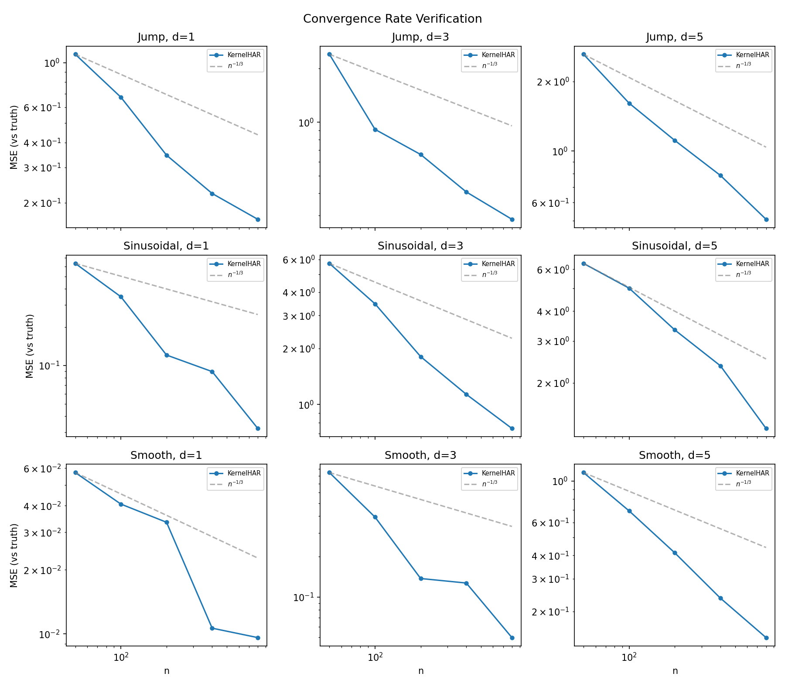
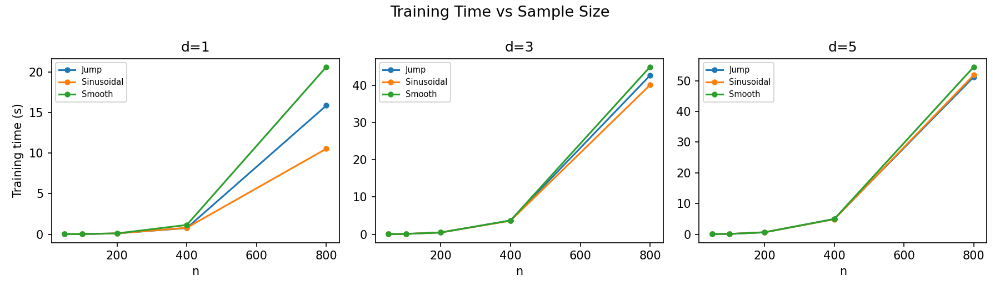
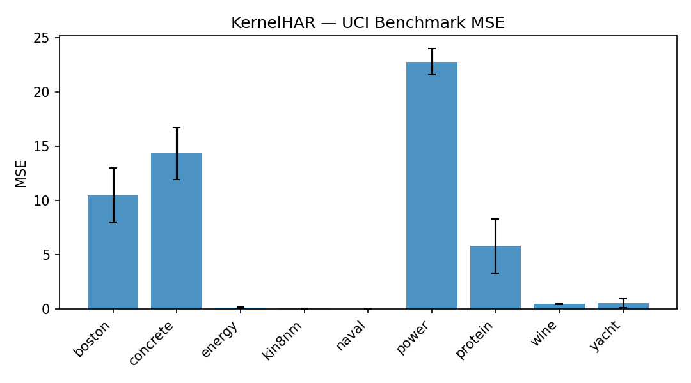

# Highly Adaptive Ridge (HAR)

A nonparametric regression method with provably fast, dimension-free convergence rates via data-adaptive kernel ridge regression.

> **Highly Adaptive Ridge**
> Alejandro Schuler, Alexander Hagemeister, Mark van der Laan
> Division of Biostatistics & EECS, UC Berkeley (2024)
> [arXiv:2410.02680](https://arxiv.org/abs/2410.02680) | [Full paper (Markdown)](docs/HAR_Paper.md)

## Abstract

We propose the Highly Adaptive Ridge (HAR): a nonparametric regression method that achieves a remarkable $O_P(n^{-1/3} (\log n)^{2(p-1)/3})$ dimension-free $L_2$ convergence rate in the class of right-continuous functions with square-integrable sectional derivatives. This is a large nonparametric function class that is particularly appropriate for tabular data. HAR is exactly kernel ridge regression with a specific data-adaptive kernel based on a saturated zero-order tensor-product spline basis expansion. The kernel computes inner products in the $n \cdot 2^p$-dimensional basis space without ever materializing the basis matrix, reducing training to $O(n^3)$ kernel ridge regression regardless of covariate dimension $p$. We use simulation and real data to confirm our theory and demonstrate empirical performance better than state-of-the-art algorithms for small datasets in particular.

## Key Results

### Convergence Rate (Theorem 1, [Paper §3.1](docs/HAR_Paper.md#31-convergence-rate))

Under mild conditions on the data-generating process, HAR achieves:

$$\|\hat{f}_n - f\| = O_P\!\left(n^{-1/3} (\log n)^{2(p-1)/3}\right)$$

in the class of càdlàg functions with bounded sectional variation. This rate is remarkable because:

- **Dimension-free** (up to log factors) — no curse of dimensionality. In contrast, the minimax rate in a Hölder smoothness class is $n^{-\beta/(2\beta+p)}$, which degrades rapidly with $p$.
- **Rich function class** — càdlàg functions of bounded sectional variation include highly nonlinear and even discontinuous functions. The variation norm bounds multi-variable interaction complexity without imposing additive structure or requiring higher-order differentiability ([Paper §2](docs/HAR_Paper.md#càdlàg-and-sectional-variation)).
- **Minimax-optimal** — matches the known minimax rate $n^{-1/3}(\log n)^{2(p-1)/3}$ for this function class, established by Fang et al. (2019).

#### Empirical Verification

We verify the theoretical rate on three synthetic data-generating processes (DGPs) designed to stress-test different properties of the estimator:

- **Smooth** — polynomials with linear, quadratic, and interaction terms (e.g., $f(x) = 0.07x_1 - 0.28x_1^2 + 0.05x_2 + 0.25x_2 x_3$ for $d=3$). Tests performance on smooth, continuously differentiable targets.
- **Jump** — piecewise constant functions with multiple discontinuities and indicator-variable interactions (e.g., $f(x) = -2 \cdot \mathbf{1}(x_1 < -3) \cdot x_3 + 2.5 \cdot \mathbf{1}(x_1 > -2) - \ldots$). Tests the ability to handle functions that are only càdlàg, not smooth.
- **Sinusoidal** — trigonometric functions with conditional structure and multi-way interactions (e.g., $f(x) = 4x_3 \cdot \sin(\pi|x_1|/2) \cdot \mathbf{1}(x_2 < 0) + \ldots$). Tests performance on oscillatory targets with variable interactions.

Each DGP is run at dimensions $d \in \{1, 3, 5\}$ with features drawn from heterogeneous marginal distributions (uniform, Bernoulli, Gaussian, Gamma) and Gaussian noise ($\sigma = 1$). The figure below shows MSE against the noiseless truth, averaged over 5 trials per configuration, for sample sizes $n \in \{50, 100, 200, 400, 800\}$.



*Log-log plot of MSE vs. sample size across 9 DGP/dimension combinations. Blue line: KernelHAR (mean over 5 trials). Dashed gray: $n^{-1/3}$ reference slope. Each panel is one DGP at one dimension. The empirical MSE tracks or exceeds the theoretical rate across all settings — notably, HAR converges faster than $n^{-1/3}$ on the Smooth and Sinusoidal DGPs (especially at $d=1$), where the additional smoothness of the target function allows the estimator to exceed the worst-case bound. On the Jump DGP, which contains true discontinuities, HAR still matches the $n^{-1/3}$ rate, confirming that the convergence guarantee holds even for non-smooth targets. See [Paper §4](docs/HAR_Paper.md#4-demonstration) and [`experiments/run_simulations.py`](experiments/run_simulations.py).*

### Computational Scalability ([Paper §3.2](docs/HAR_Paper.md#32-computation))

Because HAR reduces to kernel ridge regression via the Woodbury identity, training requires inverting an $n \times n$ matrix — an $O(n^3)$ operation — rather than working with the $n \cdot 2^p$ basis matrix directly. The covariate dimension $p$ enters only through the kernel evaluation $K(x, x') = \sum_i 2^{|s_i(x,x')|}$, which is $O(np)$ per pair.

The timing profile below shows wall-clock training time (including cross-validation over 6 regularization parameters) across sample sizes and dimensions.



*Training time (seconds) vs. sample size for each DGP at $d \in \{1, 3, 5\}$. Training cost grows super-linearly in $n$, consistent with the $O(n^3)$ matrix inversion bottleneck: the jump from $n=400$ to $n=800$ shows roughly an 8x increase, matching the expected cubic scaling. Critically, increasing dimension from $d=1$ to $d=5$ adds only modest overhead — the per-panel curves are similar in shape, confirming that the kernel trick makes HAR scalable in $p$. All experiments complete within a minute on a single CPU, even at $n=800$ with $d=5$. See [`experiments/run_simulations.py`](experiments/run_simulations.py).*

### Real-Data Benchmarks ([Paper §4](docs/HAR_Paper.md#4-demonstration))

To evaluate HAR beyond synthetic settings, we benchmark on 9 UCI regression datasets spanning a range of sample sizes ($n$) and feature dimensions ($p$):

| Dataset | $n$ | $p$ | Description |
|---------|-----|-----|-------------|
| Yacht | 308 | 6 | Hydrodynamic performance prediction |
| Boston | 506 | 13 | Housing price prediction |
| Energy | 768 | 8 | Building energy efficiency |
| Concrete | 1030 | 8 | Compressive strength prediction |
| Wine | 1599 | 11 | Wine quality rating |
| Power | 9568 | 4 | Power plant energy output |
| Kin8nm | 8192 | 8 | Robot arm forward kinematics |
| Naval | 11934 | 16 | Gas turbine compressor degradation |
| Protein | 45730 | 9 | Protein tertiary structure prediction |

For datasets with $n > 1000$, a random subsample of 1000 observations is used. Features are standardized. Each dataset is evaluated over 5 random 80/20 train/test splits.



*Mean MSE with standard deviation error bars across 5 random splits per dataset. HAR achieves near-zero MSE on Energy, Kin8nm, and Naval — datasets with moderate dimensionality and sufficient structure for the kernel to exploit. Performance on Boston and Concrete reflects the difficulty of these targets (noisy, fewer structural regularities). The higher MSE on Power is expected given the subsampling from $n=9568$ to $n=1000$, which discards most of the training signal. Across all datasets, the low variance across splits (narrow error bars) indicates stable generalization. See [`experiments/run_benchmarks.py`](experiments/run_benchmarks.py).*

## Method

### Function Class ([Paper §2](docs/HAR_Paper.md#2-notation-and-preliminaries))

HAR targets càdlàg functions (right-continuous with left limits) of bounded sectional variation on $[0,1]^p$. The sectional variation norm measures total oscillation across all variable subsets:

$$\|f\|_v = \sum_{s \subseteq \{1\ldots p\}} \int_0^1 |df_s(x)|$$

where $f_s(x)$ is the "$s$-section" of $f$ — the function evaluated after zeroing out all coordinates not in $s$. For a function of one variable this is simply the total "elevation gain plus loss" over the domain.

Bounding sectional variation limits multi-variable interaction complexity while permitting nonlinearity and discontinuity. This places it between two extremes:

- **Hölder smoothness classes** suffer the curse of dimensionality: minimax rate $n^{-\beta/(2\beta+p)}$.
- **Additive structure** ($f(x) = \sum_j f_j(x_j)$) achieves a dimension-free $n^{-1/3}$ rate but rules out all variable interactions.

Bounded sectional variation yields the best of both: a nearly dimension-free rate in a class that permits interactions, nonlinearity, and discontinuity. The variation norm penalizes the "amount" of interaction (for smooth functions of two variables, $\|f\|_v$ includes $\int |\partial^2 f / \partial x_1 \partial x_2|$) without eliminating it entirely.

### Estimator ([Paper §3](docs/HAR_Paper.md#3-method))

HAR constructs $d = n \cdot 2^p$ tensor-product zero-order spline basis functions with data-adaptive knots. For each training point $X_i$ and each subset $s \subseteq \{1\ldots p\}$:

$$h_{i,s}(x) = \prod_{j \in s} \mathbf{1}(X_{i,j} \leq x_j)$$

The estimator minimizes empirical squared-error loss with an $L_2$ penalty on coefficients:

$$\hat{f}_n = \arg\min_{\|\beta\|^2 \leq M_n} \frac{1}{n}\sum_i \left(H(X_i)^\top \beta - Y_i\right)^2$$

where $M_n$ is selected via cross-validation from a grid of regularization parameters. The $L_2$ penalty (rather than $L_1$ as in HAL) is the key design choice — it transforms the combinatorially large basis expansion into a tractable kernel problem.

A subtlety in the theory: the $L_2$ bound $M_n$ must shrink at an appropriate rate as $n$ grows. Without this, the HAR function class expands faster than $\mathcal{F}(M)$ because new training points add new basis functions. The proof of Theorem 1 shows that cross-validation selects a bound satisfying $M \leq n^{-1} M_n \leq \bar{M}$, which keeps the estimator inside the required Donsker class while not excluding relevant functions ([Paper §A](docs/HAR_Paper.md#a-proof-of-theorem-1)).

### Kernel Trick ([Paper §3.2](docs/HAR_Paper.md#32-computation))

The Lagrangian form of the ridge problem has closed-form solution $\hat{\beta} = (H^\top H + \lambda I_d)^{-1} H^\top Y$, but the $d \times d$ matrix is intractable for even moderate $p$. Applying the Woodbury identity yields the dual form $\hat{f}_n(x) = H(x)^\top H^\top (HH^\top + \lambda I_n)^{-1} Y$, which depends only on inner products $H(x)^\top H(x')$.

These inner products admit a simple closed-form kernel:

$$K(x, x') = \sum_{i=1}^{n} 2^{|s_i(x, x')|}$$

where $s_i(x, x') = \{j : X_{i,j} \leq \min(x_j, x'_j)\}$. The derivation proceeds by observing that the product of indicator bases is nonzero only when $s \subseteq s_i(x,x')$, and summing $\sum_{s \subseteq s_i} 1 = 2^{|s_i|}$. This reduces to: compare the elementwise minimum $x \wedge x'$ to each training point $X_i$, count matching dimensions, and sum $2$ raised to those counts.

No basis matrix is ever instantiated. No additional tuning parameters are introduced. Training reduces to solving an $n \times n$ linear system after computing the $n \times n$ kernel matrix.

## Related Work ([Paper §3.3](docs/HAR_Paper.md#33-related-work))

| Method | Penalty | Rate | Computational Cost | Trade-offs |
|--------|---------|------|--------------------|------------|
| **HAR** (this work) | $L_2$ | $n^{-1/3}(\log n)^{2(p-1)/3}$ | $O(n^3)$ via kernel | Requires 1st-order smoothness ($df_s/dF_s$ bounded); not "exportable" (predictions need full training data) |
| HAL | $L_1$ | $n^{-1/3}(\log n)^{2(p-1)/3}$ | $O(n \cdot 2^p)$ basis + lasso | No smoothness assumption; computationally intractable for $p > 15\text{-}20$ |
| LTB | $L_1$ (boosted) | $n^{-1/3}(\log n)^{2(p-1)/3}$ | Iterative boosting | Requires sequential optimization; no smoothness assumption |
| KRR (fixed kernel) | $L_2$ | Depends on kernel/class | $O(n^3)$ | Requires user-specified kernel; rates proven for standard smoothness/sparsity classes |

HAR's advantage over HAL is computational: both achieve the same rate, but HAL requires explicitly constructing the $n \cdot 2^p$ basis matrix and solving a lasso problem — infeasible for $p > 15\text{-}20$ even at moderate $n$. HAR's kernel trick sidesteps this entirely.

HAR's advantage over standard KRR is that the kernel is constructed automatically from the data rather than chosen by the user. This means no kernel selection, no bandwidth tuning — only the regularization parameter $\lambda$, which is handled by cross-validation.

The trade-off is that HAR requires a mild 1st-order smoothness condition ($df_s/dF_s$ bounded) not required by HAL, and predictions require access to the full training covariate matrix (no explicit $\hat{\beta}$ vector is available).

## Reproducing Paper Results

```bash
git clone https://github.com/AlexHagemeister/HighlyAdaptiveRidge.git
cd HighlyAdaptiveRidge
pip install -e .

# Convergence rate + timing experiments (Paper §4, synthetic data)
# Runs 3 DGPs x 3 dimensions x 5 sample sizes x 5 trials = 225 fits
# Expected runtime: ~5-15 min
python experiments/run_simulations.py

# UCI benchmark experiments (Paper §4, real data)
# Runs 9 datasets x 5 splits = 45 fits
python experiments/run_benchmarks.py

# Generate all figures from saved results
python experiments/plot_results.py
```

Results are saved as JSON in `results/`. Figures are written to `results/figures/`. If figures are missing above, run the experiment scripts first, then `plot_results.py` to regenerate them.

## Running Tests

```bash
pip install -e ".[dev]"
pytest
```

## Repository Structure

```
har/                      # Core implementation
├── kernel_har.py         # Kernelized HAR via Woodbury identity (Paper §3.2)
├── hal.py                # Highly Adaptive Lasso baseline (Paper §3.3)
└── data_generators.py    # Synthetic DGPs: Smooth, Jump, Sinusoidal (Paper §4)

experiments/              # Reproducibility scripts
├── run_simulations.py    # Convergence + timing on synthetic data (Paper §4)
├── run_benchmarks.py     # UCI real-data evaluation (Paper §4)
└── plot_results.py       # Figure generation from JSON results

tests/                    # Test suite
data/                     # UCI benchmark datasets (CSV, last column = target)
results/                  # Experiment outputs
├── simulation_results.json
├── benchmark_results.json
└── figures/              # Generated plots (convergence, timing, benchmarks)
docs/
└── HAR_Paper.md          # Full paper with proofs (Appendix A, B)
```

## Citation

> Schuler, A., Hagemeister, A., & van der Laan, M. (2024). **Highly Adaptive Ridge.** *arXiv preprint arXiv:2410.02680.* [arXiv:2410.02680](https://arxiv.org/abs/2410.02680)
